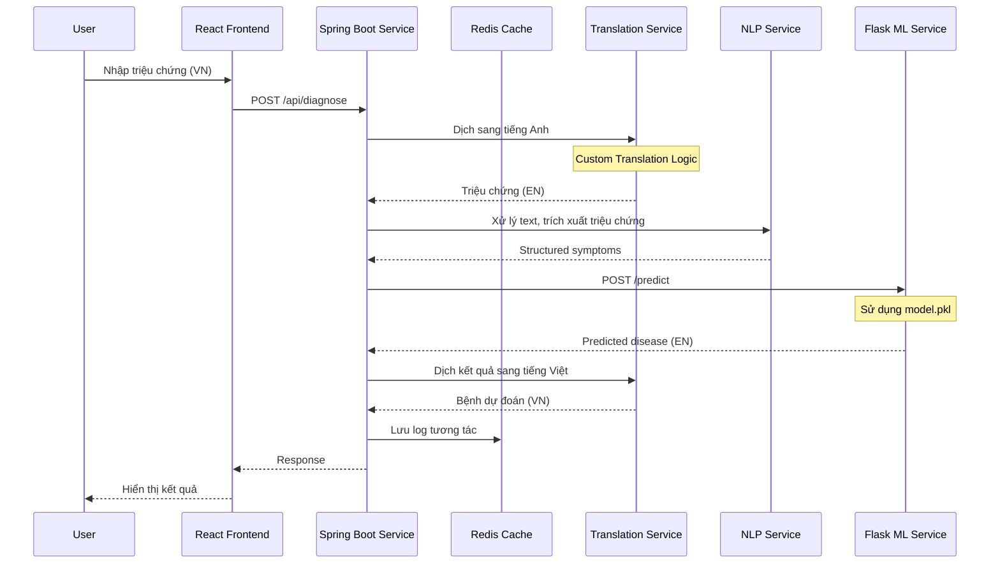

```mermaid
sequenceDiagram
    participant U as User
    participant FE as React Frontend
    participant SB as Spring Boot Service
    participant R as Redis Cache
    participant T as Translation Service
    participant NLP as NLP Service
    participant F as Flask ML Service
    
    U->>FE: Nhập triệu chứng (VN)
    FE->>SB: POST /api/diagnose
    
    %% Xử lý Translation & NLP
    SB->>T: Dịch sang tiếng Anh
    Note over T: Custom Translation Logic
    T-->>SB: Triệu chứng (EN)
    SB->>NLP: Xử lý text, trích xuất triệu chứng
    NLP-->>SB: Structured symptoms
    
    %% Dự đoán bệnh
    SB->>F: POST /predict
    Note over F: Sử dụng model.pkl
    F-->>SB: Predicted disease (EN)
    
    %% Dịch kết quả
    SB->>T: Dịch kết quả sang tiếng Việt
    T-->>SB: Bệnh dự đoán (VN)
    
    %% Lưu log
    SB->>R: Lưu log tương tác
    
    SB-->>FE: Response
    FE-->>U: Hiển thị kết quả
```